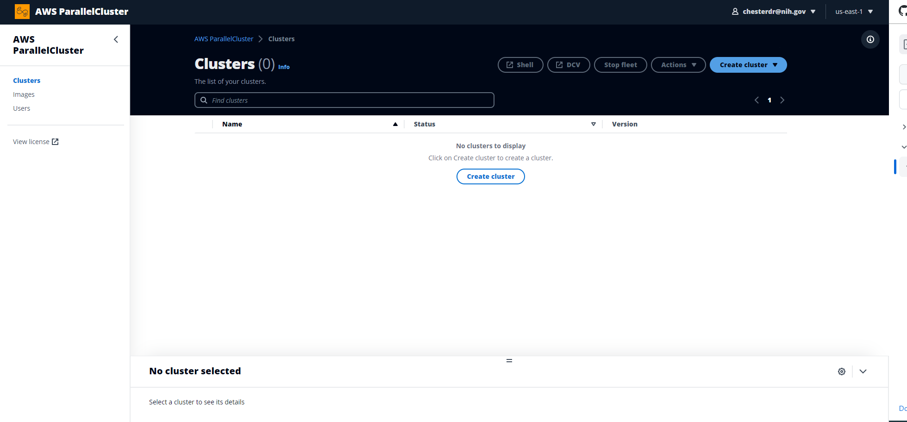

# Installing the AWS ParallelCluster User interface (UI)

 ## To install an instance of the AWS ParallelCluster UI choose an AWS Cloud Formation quick-create link for the AWS region you want the cluster in.
  
The AWS ParallelCluster UI is a web-based user interface that mirrors the AWS ParallelCluster pcluster CLI, while providing a console-like experience. You install and access the AWS ParallelCluster UI in your AWS account. When you run it, the AWS ParallelCluster UI accesses an instance of the AWS ParallelCluster API hosted on Amazon API Gateway in your AWS account.
  
The AWS documentation for installing the PCUI can be found [here](https://docs.aws.amazon.com/parallelcluster/latest/ug/install-pcui-v3.html). 

To install an instance of the AWS ParallelCluster UI (PCUI), you choose an AWS CloudFormation quick-create link for the AWS Region that you create clusters in. The quick-create URL takes you to a Create Stack Wizard where you provide quick-create stack template inputs and deploy the stack. 

The quick link for creating this stack within the us-east-1 region can be found [here](https://us-east-1.console.aws.amazon.com/cloudformation/home?region=us-east-1#/stacks/create/review?stackName=parallelcluster-ui&templateURL=https://parallelcluster-ui-release-artifacts-us-east-1.s3.us-east-1.amazonaws.com/parallelcluster-ui.yaml)

**Use an AWS CloudFormation quick-create link to deploy an PCUI stack with nested Amazon Cognito, API Gateway, and Amazon EC2 Systems Manager stacks.**

1. Sign in to the AWS Management Console.
2. Deploy the PCUI by choosing an AWS Region quick-create link from the table at the start of this section. This takes you to the CloudFormation **Create Stack Wizard** in the console.
3. Enter a valid email address for **Admin's Email.**
4. Enter an **ImageBuilder Custom VPC**. This can be found in the VPC Dashboard on AWS Console. 
5. After deployment completes successfully, the PCUI sends you a temporary password to this email address. You use the temporary password to access the PCUI. If you delete the email before you save or use the temporary password, you must delete the stack and reinstall the PCUI.
6. Keep the rest of the form blank or enter values for (optional) parameters to customize the PCUI build.
7. Note the stack name for use in later steps.
8. Navigate to **Capabilities.** Agree to the CloudFormation capabilities.
9. Choose **Create.** It takes about 15 minutes to complete the AWS ParallelCluster API and PCUI deployment.
10. View the stack details as the stack is created.
11. After the deployment completes, open the admin email that was sent to the address you entered. It contains a temporary password that you use to access the PCUI. If you permanently delete the email and you haven’t yet logged in to the PCUI, you must delete the PCUI stack you created and reinstall the PCUI.
12. In the AWS CloudFormation console list of stacks, choose the link to the stack name that you noted in a previous step.
13. In **Stack details**, choose **Outputs** and select the link for the key named **StacknameURL** to open the PCUI. Stackname is the name that you noted in a previous step.
14. Enter the temporary password. Follow the steps to create your own password and log in.
15. You are now on the home page of the PCUI in the AWS Region that you selected.

   

 
# Installing the AWS ParallelCluster CLI:

    - Using a virtual environment (recommended)
    - Using a conda virtual environment 
 
 We recommend conducting all steps within AWS Cloud Shell, but you could also use a small Ec2 instance or your local machine's terminal.     

 ## 1.0 Install within pip virtual environment
 
 ## 1.1 Install pip virtual environment
 
  If virtualenv is not installed, install virtualenv using pip3

        -Linux, macOS, or Unix
      
            $ python3 -m pip install --upgrade pip
            $ python3 -m pip install --user --upgrade virtualenv
     

        -Windows
    
            $ pip3 install --user --upgrade virtualenv

 
 ### 1.2 Create a pip virtual environment and name it

         -Linux, macOS, or Unix
          
            $ python3 -m virtualenv ~/name
        

        -Windows
        
            C:\>virtualenv %USERPROFILE%\name

 ### 1.3 Activate your new virtual environment
 
        -Linux, macOS, or Unix
          
            $ source ~/name/bin/activate
        
        -Windows
        
            C:\>%USERPROFILE%\name\Scripts\activate

 ### 1.4 Install AWS ParallelCluster into your virtual environment.

        -Linux, macOS, or Unix
          
            (name)~$ python3 -m pip install --upgrade "aws-parallelcluster<3.0"
        
        -Windows
        
            (apc-ve) C:\>pip3 install --upgrade "aws-parallelcluster<3.0"

 ## 2.0 Install within conda virtual environment
 
 ### 2.1 (Optional) Install mamba
 ```
curl -L -O https://github.com/conda-forge/miniforge/releases/latest/download/Mambaforge-$(uname)-$(uname -m).sh
bash Mambaforge-$(uname)-$(uname -m).sh -b -p $HOME/mambaforge
# Add to your PATH
export PATH="$HOME/mambaforge/bin:$PATH"
```
 ### 2.2 Create environment and install parallel cluster
 ```
 mamba create -n pcluster -c conda-forge aws-parallelcluster -y
 ```
 
 ### 2.3 Activate environment
 ```
 source activate pcluster
 ```
 Or, using mamba activate
 ```
 mamba init
 mamba activate pcluster
 ```

 ## 4. Verify that AWS ParallelCluster is installed correctly
               
        -Linux, macOS, or Unix
          
            $ pcluster version
        
        -Windows
        
            (apc-ve) C:\>pcluster version

    Output should display version number.

 ## 5. Move on to configuring and connecting to your cluster
 Follow the [next instructions](/docs/Configure_AWSParallelCluster.md) on how to configure your cluster via the command line. Otherwise, check out our tutorial for using Parallel Cluster via the console to run **Snakemake workflows** [here](https://github.com/STRIDES/NIHCloudLabAWS/blob/main/notebooks/Snakemake/AWS-ParallelCluster.ipynb).


