# Creating and Searching a database using Amazon Athena

1) Navigate to the Amazon Athena homepage. Click **Data sources and catalogs**.

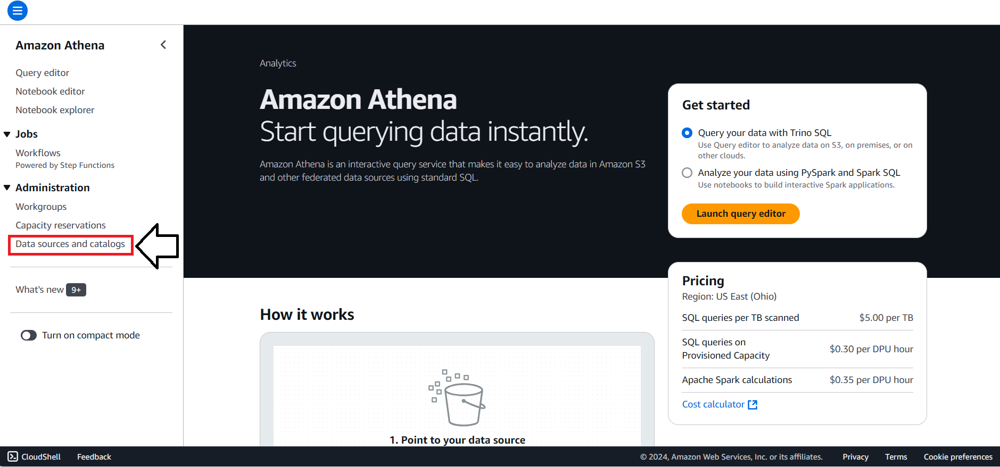

2) Click **Create data source**. Note that you probably won't yet have any data sources listed as we do in the following screenshot. 

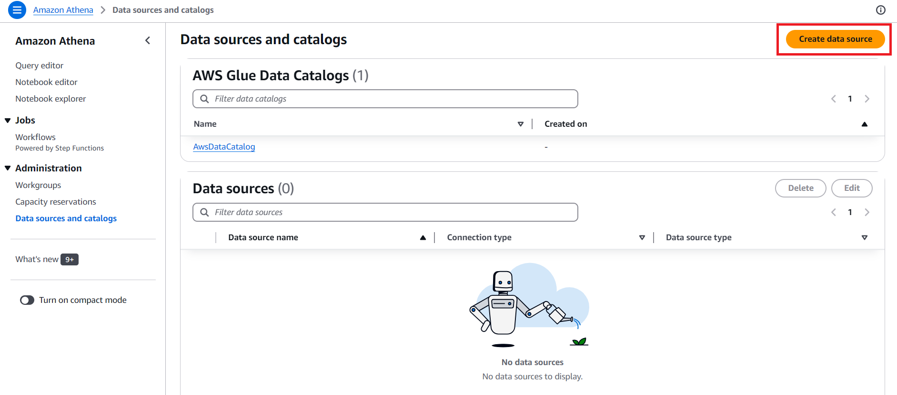

3) Select *S3 - AWS Glue Data Catalog*. Scroll down and click **Next**.

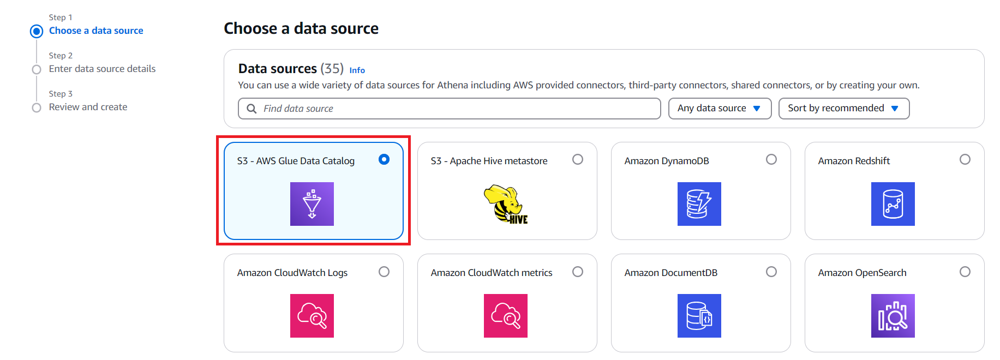

4) Select *AWS Glue Catalog in this account* and *Create a crawler in AWS Glue*. Click **Create in AWS Glue**.

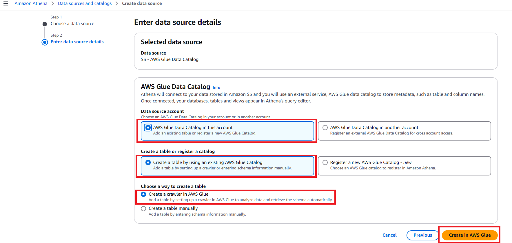

5) Name your crawler and then click **Next**. Make sure you do not include `-` or any special characters other than `_` in the name, otherwise you can have issues further down.

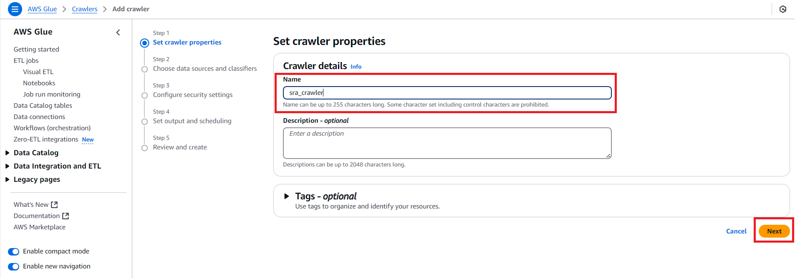

6) Click **Add a data source**.

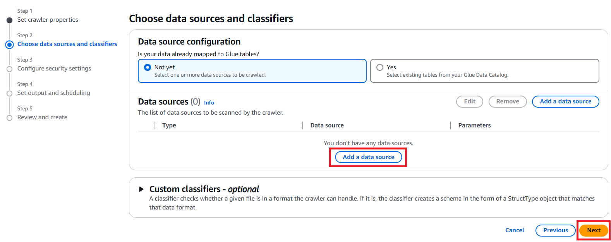

7) Now we add the data source.

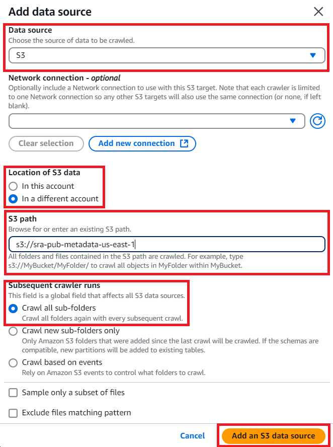

8) Select **Create an IAM role**, give your role some kind of name like `sraCrawler`. Click on `Update choosen IAM Role`. This will add a role and grant it permissions to access the public S3 bucket. Click **Next**.

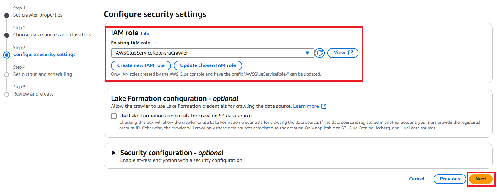

9) For **Target database**, Click **Add database**. 

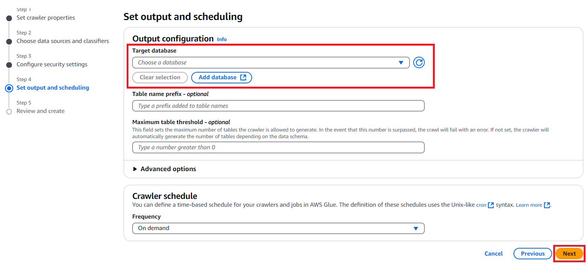

10) Name your database. Click **Create database**.

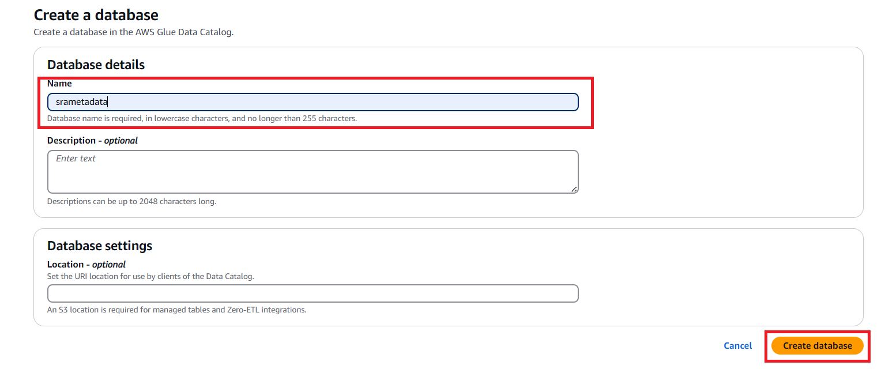

11) Click **Run crawler**.

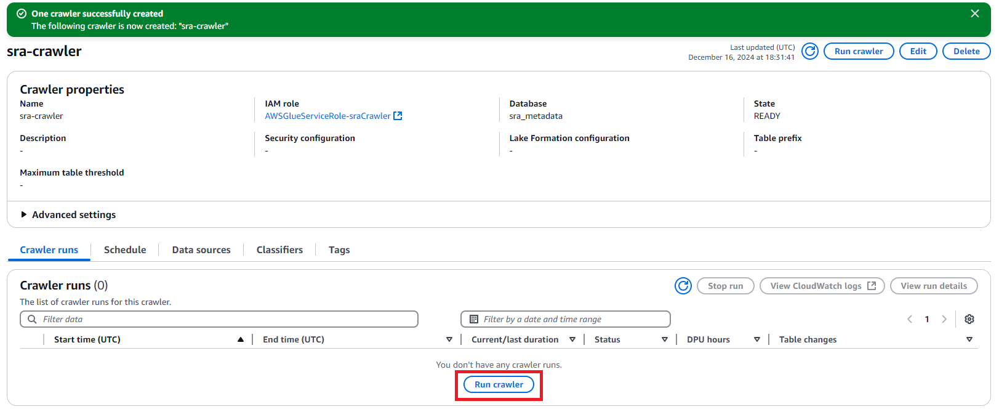

## Query the database via Athena user interface

1) Navigate to the `Amazon Athena > Query editor`. Before you run you need to set up query result location in Amazon S3. Click `Edit setting`.

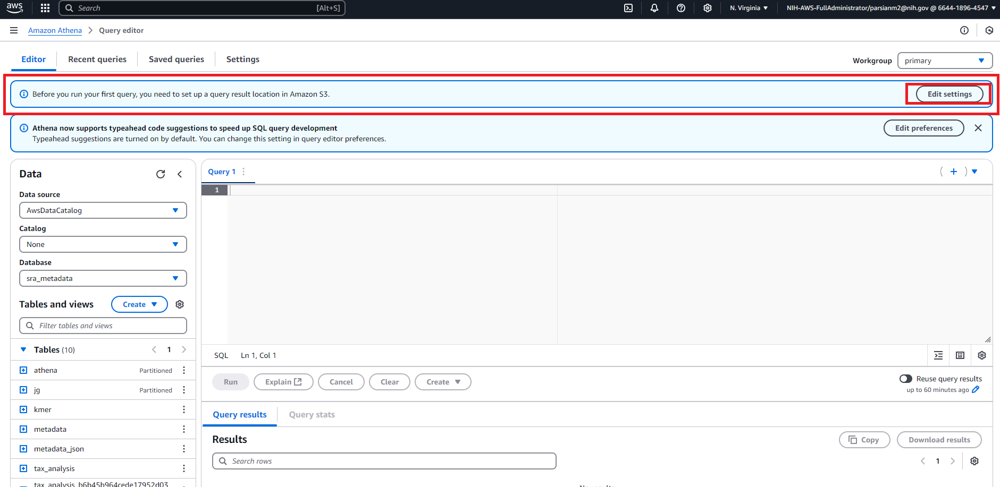

2) Click `Browse S3`.

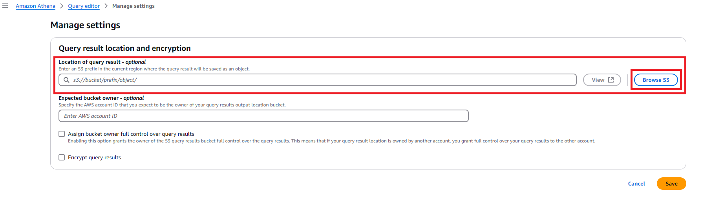

3) Choose a S3 bucket.

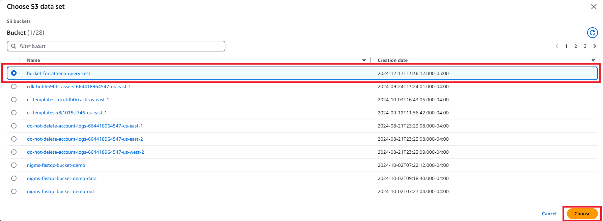

4) After saving the setting you can run your query.

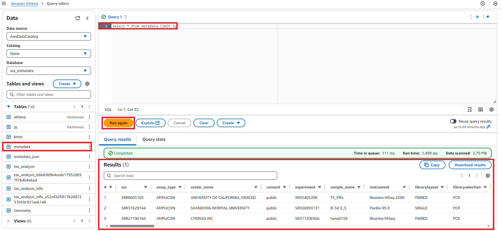

## Query a databse via Jupyter Notebook

You can query a database via a Jupyter Notebook. We provide an example [here](https://github.com/STRIDES/NIHCloudLabAWS/blob/main/notebooks/SRADownload/SRA-Download.ipynb), as well as [these examples](https://github.com/ncbi/ASHG-Workshop-2021). 